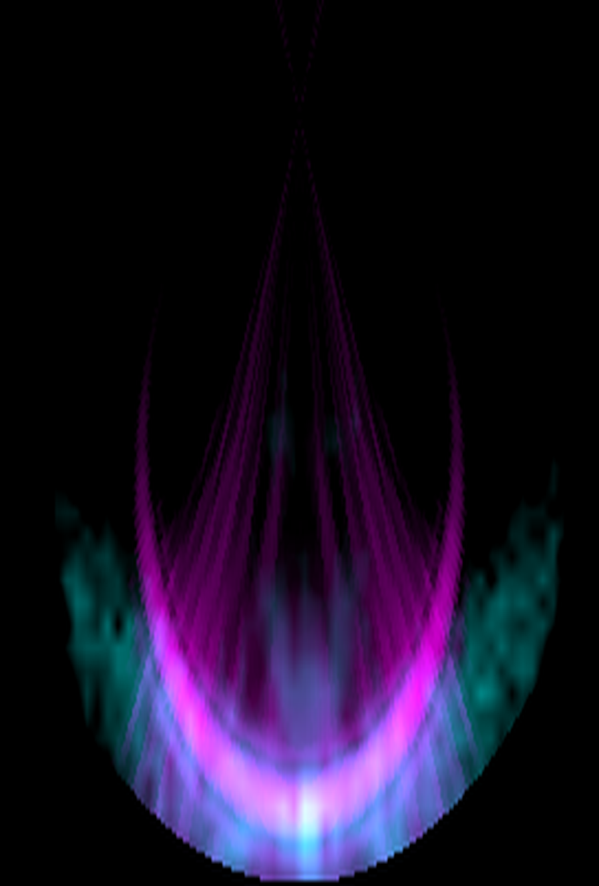
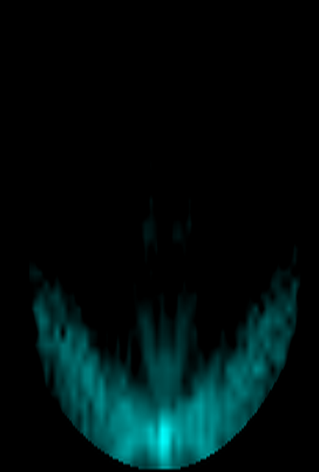
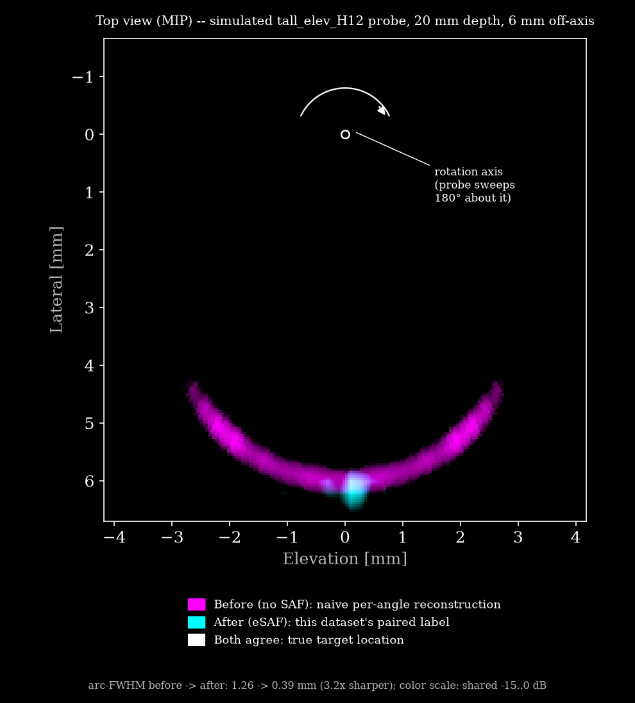

# OpenH-RF Sub-Dataset — Rotational 3D US Raw Channel Data for Elevational SAF (Simulated + Measured Phantom)

<p align="center"></p>

**Main image (`assets/main.png`).** A top-view maximum-intensity-projection
through the target depth, looking straight down the rotation axis, of a single
target reconstructed two ways at once — encoded by color, not by side-by-side
panels, both on the same dB scale:
**magenta = naive** (one in-plane B-mode per rotation angle, gridded straight
into 3D by rotation angle, no SAF), **cyan = this dataset's paired eSAF label**
(`custom/saf_bmode`, already shipped in every file). Where the two agree —
the true target — the overlay goes white / pale blue. The long magenta arc is
exactly the rotational-smear artifact this dataset's Known Issues describe;
eSAF collapses it back onto the target.

Simulated `tall_elev_H12` probe, point target at **20 mm depth, 6 mm off the
rotation axis**
([`data/tall_elev_H12__point_z020_r6.hdf5`](https://huggingface.co/datasets/nvidia/OpenH-RF/blob/main/wpi/data/tall_elev_H12__point_z020_r6.hdf5),
arc-FWHM 1.26 mm → 0.39 mm, ~3.2×, see that file's
`custom/saf_bmode/values.description`). The sim grid's depth axis is only
{20, 45, 80, 130} mm — there is no simulated 10 mm case (10 mm exists only
as a measured-phantom scan) — so this is the shallowest off-axis (r0 ≥ 4 mm)
simulated case available, chosen for the largest before→after gain among the
probe/radius combinations at that depth.

<p align="center"></p>

Same color coding, animated, with the geometry made explicit: the small
circle is the **rotation axis** (the probe's own axial axis, perpendicular to
the page), and the white line through it is the array's **current physical
orientation** as it sweeps 180°. The magenta (naive) side fills in one angle
at a time as the line sweeps — this is what accumulates if you *don't* run
eSAF on this data — while the cyan (eSAF) side is already fully known
throughout.

<p align="center"></p>

The same overlay again, annotated for readers who want the scale bar, an
explicit color legend, and the rotation geometry spelled out rather than
left to the caption above.

<p align="center"></p>

Unrelated to the eSAF comparison above: `reconstruct.py`'s own reference
output — a single measured-phantom frame (frame 90, ~-90°) plus the per-frame
rotation-angle trajectory this dataset adds — checked in at `assets/bmode.png`.

## Dataset Description
Synthetic rotational 3D ultrasound acquisitions of point, pair, and off-axis targets, captured
with an **elevation-focused 1D linear array** that is rotated 180° about its axial
axis (1° steps, 180 frames). Each acquisition stores the **raw per-element channel
RF** for a single normal plane-wave transmit at every rotation angle — i.e. the data
*before* in-plane beamforming — which is what enables flexible offline beamforming and
the **elevational Synthetic Aperture Focusing (eSAF)** method. The targets span a wide
depth range to capture the depth-dependent elevational beam thickness (the artifact
eSAF corrects). The release is **mostly simulated (Field II)**, complemented by a
small set of **real measured phantom** rotational scans acquired with the physical
Japan Probe 68-element array (same geometry as the simulation) over a shallow-to-focal
depth series (10–45 mm). **Simulated + measured phantom** data (no in-vivo / subjects).

## Dataset Contributor(s)
Medical FUSION Laboratory, Worcester Polytechnic Institute. Contact: Ryo Murakami.

## Dataset Creation Date
06/15/2026.

## License / Terms of Use
CC BY 4.0 (full text in `LICENSE`). The release contains **simulated (Field II) and
real measured phantom** rotational scans — inanimate phantom only, so there are no
IP, subject-consent, or IRB constraints.

**Citation.** When using this dataset, please cite:
> R. Murakami et al., "Elevational Synthetic Aperture Focusing for Rotated
> Array-Based Three-Dimensional Ultrasound Imaging," IEEE Access, 2025.

## Intended Usage
Advanced beamforming and **elevational resolution recovery** for rotational 3D US
(eSAF), elevation-PSF / aperture-growth studies, and as a reproducible raw-channel-data
benchmark for rotational synthetic-aperture reconstruction.

## Dataset Characterization
- **Data Collection Method:** synthetic, generated with **Field II** (Jensen) run in
  **MATLAB**. The main release is a **probe × target grid** produced by
  `sim/batch_sim_probe_target.m` (source) (with `sim/sim_probe_catalog.m` /
  `sim/sim_target_catalog.m`, source): for each (probe type, target) it uses `xdc_focused_array`
  + `calc_scat_multi` to produce the raw per-element channel RF at every rotation angle
  (scatterer rotated about the axial axis, transducer fixed), then `sim/sim_dataset_to_zea.py`
  (source) repackages every case into the zea format here. **10 probe types** span lateral aperture
  (`n_el` 32/68/128, pitch 0.1/0.2/0.3 mm), elevation height `H` (4/8/12 mm), and elevation
  focal depth `R` (25/45/90 mm + unfocused) — encoded directly in each probe's name
  (e.g. `tall_elev_H12` = `H` 12 mm; `baseline_R45_H8` = `R` 45 mm, `H` 8 mm) and in
  `probe/*` (geometry, element size) inside each `.hdf5`.
  (The earlier 18-acquisition set generated by `sim/batch_generate_fieldii.m` +
  `sim/mat_to_zea.py` (source) remains available as a compatible alternative with the
  identical schema.)
  **Measured phantom acquisitions (5):** real rotational scans of the physical Japan
  Probe 68-element array on a wire/point phantom, acquired with CPWC channel-RF capture
  (`experiment/Ryo_SetUp_JP68_PWCompound_3D_ChannelRF.m`, source) and a Galil-controlled 180°
  rotation. Each scan is time-tag-synced (frames → motor angles) and reduced to the
  **single centre (normal) plane wave per angle** by `experiment/sync_channel_rf.m` (source)
  (so the schema matches the simulation, n_tx = 1), then converted with the same
  `sim/sim_dataset_to_zea.py` (source). They span a shallow-to-focal depth series (10, 20, 30,
  40, 45 mm nominal target depth).
- **Labeling Method:** synthetic ground truth (exact target positions known; each
  file's top-level `description` attribute records the probe name and target
  name/depth/radius, e.g. `probe=tall_elev_H12 target=point_z020_r6 r0=6.0mm z=20.0mm`).
- **Acquisition system (simulated):** Japan Probe JP_Linear_68 — 68-element linear
  array, pitch 0.2 mm, element width 0.15 mm, element height 8 mm, **elevational lens
  focus 45 mm** (Field II `xdc_focused_array` with 500 elevation math sub-elements);
  center frequency 10 MHz; sampling 40 MHz (NS200BW, 4 samples/wavelength); speed of
  sound 1490 m/s; single normal plane-wave transmit per rotation angle; 180° rotation,
  1° step (180 frames). Parameters match the paper simulation.

## Dataset Format
zea file format (HDF5), one file per acquisition, **single track**: the raw
channel RF + scan parameters live in the standard data/scan groups
(`tracks/track_0` on disk), and the paired eSAF label volume is stored as a
**zea custom field** in the `custom` group (`custom/saf_bmode`, read via
`zea.File.custom` — see below). The fused SAF volume is a single frame, so it
cannot share the data group with the ~180-frame `raw_data` (zea validates
`n_frames` across all fields of a data group); the `custom` group is the zea
mechanism for exactly such data, and keeping the file single-track avoids the
`track_schedule` warning a multi-track file would print on every load.
Pre-processing — *simulated:* none
beyond the forward model (raw RF, not demodulated/decimated); *measured:* time-tag
frame→angle synchronisation, per-angle dwell averaging, and centre-plane-wave selection
(still raw per-element RF, not demodulated/decimated; `scan/demodulation_frequency`
records the 10 MHz demodulation applied by the reference pipeline). The probe
rotation per frame is stored as the zea **`metadata/probe_pose`** trajectory
(`rotation_representation="euler_xyz"`, **radians**; the array rotates about its
axial axis, so the angle is the z Euler component and the translation is zero).
Note `probe_pose/sampling_frequency = 1.0 Hz` is a **nominal** one-pose-per-frame
value, not a physical acquisition rate. Every file is
written with `zea.File.create()` (`sim/sim_dataset_to_zea.py` +
`sim/pack_saf_labels.py`, source) and carries a
`zea_version` stamp, so zea loads it natively (not as a legacy file).

**Paired pre-/post-SAF labels (the dataset's target output).** Each file also carries
the **elevational-SAF reconstructed 3D B-mode volume** as the custom field
**`custom/saf_bmode`**: `values` is `(1, z, x, y)` float32 in **dB** (log-compressed
normalized envelope, 0 dB = volume max, empty pixels −inf) and `coordinates` holds
the per-pixel `[x, y, z]` positions in **meters**, shape `(z, x, y, 3)`; both carry
`description`/`unit` attributes. This is
the *post*-SAF **output/label** paired with the *pre*-beamformed **input**
(`data/raw_data`):
the raw channel RF is back-projected through the published eSAF algorithm
(`matlab/saf/safrot_backproj.m`, source: in-plane DAS → `recon_3d` → `safrot_backproj`,
elevational focus 45 mm, f-number 45/8) into a 3D volume `B_SAF(x,y,z)`, generated by
`sim/make_saf_all.m` → `experiment/run_esaf_synced.m` (source) and written into the zea
file by `sim/pack_saf_labels.py` (source). The stored volume covers
a thin depth window (±2 mm) about the target; per-case arc-FWHM before/after and gain
are in the `description` attribute of `custom/saf_bmode/values` (e.g. `... arc FWHM
before/after = 1.255/0.393 mm`). Read it with `zea.File`:

```python
with zea.File("data/baseline_R45_H8__point_z080_r4.hdf5") as f:
    saf = {e.name: e for e in f.custom}  # custom/saf_bmode elements
    volume_db = saf["values"].data  # (1, z, x, y) float32 dB
    coordinates = saf["coordinates"].data  # (z, x, y, 3) float32 m
    print(saf["values"].description)  # axes + eSAF parameters + arc-FWHM
```

A **MATLAB `.mat` version** of the same raw channel data + metadata, plus a
**reference eSAF-beamformed** result and a `_ref.png` figure, is provided **per
acquisition** alongside the source grid as `sim_dataset_out/<probe>/<target>.mat`
and `..._ref.png` (each `.mat` holds the raw RF, the in-plane DAS, the metadata and
the eSAF output produced with the published algorithm `matlab/saf/safrot_backproj.m`
(source): in-plane DAS → `recon_3d` → `safrot_backproj`, f-number 45/8). A FWHM-vs-depth
overview across probes is `sim_dataset_out/dataset_overview_r4.png`
(`sim/dataset_overview.m`, source). The zea `.hdf5` acquisitions are **hosted on Hugging
Face** at <https://huggingface.co/datasets/nvidia/OpenH-RF/tree/main/wpi> (git-LFS,
part of the unified OpenH-RF dataset repo). The MATLAB `.mat`/`_ref.png` intermediates are
reproducible from source and kept on lab storage.

## Dataset Quantification

**Current OpenH-RF release:** 195 HDF5 files; 1.87 GB (1,870,462,976 bytes) stored; root `zea_version` **0.1.6**. Sizes include all HDF5 contents and use decimal units (MB = 10^6 bytes, GB = 10^9 bytes, TB = 10^12 bytes), not decoded-array memory or original-source download sizes.

- **Acquisitions:** **195** = **190 simulated** + **5 measured phantom**.
  - *Simulated (190):* **10 probe types × 19 targets** (16 single points over depth
    {20,45,80,130} mm × radial offset from the rotation centre {0,2,4,6} mm, plus 3
    pair/oblique cases). The probe axis is listed above under Data Collection Method;
    each file's own `description` attribute gives its exact probe/target/r0/depth. (The
    earlier compatible set has 18 acquisitions.)
  - *Measured (5):* real rotational phantom scans at nominal depths {10,20,30,40,45} mm
    (`experiment__acq_exp_*.hdf5`), centre plane wave, ~182 measured rotation angles
    over ~180°.
- **Frames per acquisition:** simulated 180 (one per 1° step); measured ~182 (the
  actual encoder angles are stored in `metadata/probe_pose` — z Euler component,
  radians — not necessarily uniform).
- **Stored HDF5 size:** 1.87 GB (1,870,462,976 bytes), including the paired `saf_bmode` label volumes.
- **Train/val/test split:** N/A (benchmark / characterization set; the probe × depth ×
  radius axes are the intended study dimensions).

### Per-sample feature table
Shapes use placeholders because dimensions vary across the probe grid and between
simulated and measured scans: **`n_frames`** = 180 (simulated, one per 1° step) or
~182 (measured encoder angles); **`n_el`** ∈ {32, 68, 128} (probe grid; 68 for the
baseline and all measured scans); **`n_ax`** = axial sample count (per case);
**`n_z`** = depth samples of the label volume (target ± ~2 mm window).

Paths below are inside each `.hdf5`; with `zea.File` use `f.data` / `f.scan` /
`f.metadata.probe_pose`, and `f.custom` for the SAF label volume.

| field (HDF5 path)                 | shape                          | dtype   | units | description |
|-----------------------------------|--------------------------------|---------|-------|-------------|
| `tracks/track_0/data/raw_data` (`f.data.raw_data`) | (n_frames, 1, n_ax, n_el, 1) | float32 | a.u. | raw per-element channel RF; dims = (frame=rotation, tx, axial, element, ch) |
| `probe/probe_geometry`            | (n_el, 3)                      | float32 | m     | element positions (lateral x, 0, 0) |
| `tracks/track_0/scan/sampling_frequency` | scalar                  | float32 | Hz    | 4.0e7 |
| `tracks/track_0/scan/center_frequency`   | scalar                  | float32 | Hz    | 1.0e7 |
| `tracks/track_0/scan/demodulation_frequency` | scalar              | float32 | Hz    | 1.0e7 (= center frequency; used by the reference pipeline's demodulate op) |
| `tracks/track_0/scan/sound_speed` | scalar                         | float32 | m/s   | 1490 |
| `tracks/track_0/scan/initial_times` | (1,)                         | float32 | s     | t0 (first-sample time) |
| `tracks/track_0/scan/t0_delays`   | (1, n_el)                      | float32 | s     | transmit delays (0; normal plane wave) |
| `tracks/track_0/scan/polar_angles` | (1,)                          | float32 | rad   | transmit steering (0) |
| `metadata/probe_pose/rotation`    | (n_frames, 3)                  | float32 | rad   | probe pose per frame, `euler_xyz`; rotation about the axial (z) axis is the z component |
| `metadata/probe_pose/translation` | (n_frames, 3)                  | float32 | m     | probe tip translation (all zero — pure rotation) |
| `metadata/probe_pose/sampling_frequency` | scalar                  | float32 | Hz    | 1.0 — **nominal** one-pose-per-frame rate, not a physical value |
| `metadata/credit` (`f.metadata.credit`) | scalar                   | str     | –     | dataset credit / attribution (lab, contact, citation, license) |
| `metadata/subject/type` (`f.metadata.subject.type`) | scalar       | str     | –     | `simulated phantom` (Field II sims) or `phantom` (measured `experiment__*` scans) |
| `custom/saf_bmode/values` (custom field, via `f.custom`) | (1, n_z, n_el, n_el) | float32 | dB | **paired label**: elevational-SAF reconstructed 3D B-mode volume, log-compressed normalized envelope (0 dB = max, empty pixels −inf); dims = (frame, z=depth, x=lateral, y=elevation) |
| `custom/saf_bmode/coordinates` | (n_z, n_el, n_el, 3)             | float32 | m     | per-pixel `[x, y, z]` positions of the label volume (target ± ~2 mm depth window) |

## Subject Metadata
No human or animal subjects / no PHI. Each file stores `metadata/subject/type`:
`simulated phantom` for the Field II simulations, `phantom` for the measured
`experiment__*` scans. Creator attribution is stored per file in `metadata/credit`.

## Data Validation
`reconstruct.py` (**runnable, verified** — official `zea` API, no fallback code)
loads one zea acquisition, reads its acquisition parameters via
`zea.Config.from_path('pipeline.yaml')` + `File.load_parameters`, beamforms the
rotation frame closest to ±90° rotation magnitude (the frame where an off-axis target
lies in-plane; this handles signed encoder angles too — measured scans run 0 → ~−180°)
with the native `zea.Pipeline` op chain **Cast → Demodulate → Beamform(delay_and_sum) →
EnvelopeDetect → Normalize → LogCompress** defined in `pipeline.yaml`, and writes a
two-panel PNG: the B-mode image, and the per-frame probe **rotation angle**
(from `metadata/probe_pose`, plotted in degrees) so downstream users know how to
interpret the frame axis — the special data this dataset adds:
```
python reconstruct.py
```
(the script takes no CLI arguments; edit the `INPUT`/`OUTPUT`/`FRAME_INDEX` constants
at the top of the file to point at a different acquisition or frame). Reference output:
`assets/bmode.png` — frame 90 (~-90° rotation) of `data/experiment__acq_exp_30mm.hdf5`,
shown above. The rotational **eSAF** across frames — the contribution of this dataset — is implemented in
`matlab/saf` (source) (`recon_3d` → `safrot_backproj`); per-probe before/after eSAF reference
images and a FWHM-vs-depth overview accompany the MATLAB `.mat` release
(`sim/dataset_overview.m`, source), and the resulting paired SAF volume is stored as
the `custom/saf_bmode` custom field of every `.hdf5` (see Dataset Format above).

## Known Issues
- **Paired SAF label — on-axis targets (r0 = 0) do not narrow, by design.** eSAF
  refocuses the *rotational elevation smear*; a target sitting on the rotation axis has
  essentially no smear, so its `saf_bmode` label volume is not sharper than the input (arc-FWHM
  gain ≈ 1). This is expected physics, not a defect — the 40 on-axis cases (median gain
  1.00×) are included so the pair covers the degenerate no-smear case. Off-axis targets
  (n=120, median gain 1.75×, up to ~12×) and paired/oblique targets (n=30, median 3.71×)
  improve clearly; targets at the focal depth (~45 mm) and weak-elevation-focus probes
  (`efocus_deep_90`, `elev_unfocused`) have less smear to recover. Across all 195 cases,
  median arc-FWHM gain is 1.36× (42 cases < 1×, mostly the on-axis/near-focus group above).
  Arc-FWHM is measured on a **centred** reconstruction: the smear circle passes through both
  the rotation axis and the target (not a circle centred on the rotation axis). The eSAF
  back-projection uses a fixed elevational focus of 45 mm; per-depth focus tuning (see
  `docs/eSAF_focus_depth_study_JP.md`, source) can further sharpen deep off-axis cases but was
  not applied here (single as-designed focus).
- **Measured phantom depth window.** The real reflector bead sits **~4 mm off the rotation
  axis** (not on-axis) and, for each scan, slightly deeper than the folder's nominal depth
  label; labels are reconstructed over the interactively-identified reflector depth window
  (not a naive nominal-depth ± 2 mm window), which matters because a mis-centred window can
  pick up near-axis clutter instead of the actual bead.
- **Simulated** data (Field II spatial-impulse-response model): realistic transducer
  field, but no tissue attenuation, aberration, multiple scattering, or electronic
  noise. Not a substitute for measured data.
- Speed of sound is 1490 m/s, matching the paper Table 1 and the experiment.
- A single normal plane-wave transmit per rotation angle is simulated (the dataset
  stores n_tx = 1); multi-angle compounding is left to downstream users.
- **Measured scans:** acquired as 7-angle CPWC; only the **centre (0°) plane wave** is
  kept here to match the n_tx = 1 schema. The dwell frames per angle are averaged before
  storage (noise reduction). Real reflectors are not ideal point scatterers — expect
  reverberation/clutter near the surface and specular layering; rotation angles are the
  measured encoder values (slightly non-uniform, full span ≈ 180°, sign per encoder
  direction). The elevational lens focus is the nominal 45 mm, but the effective
  back-projection focus for eSAF is depth-dependent on real data (see
  `docs/eSAF_focus_depth_study_JP.md`, source).

## Raw Source Data
The raw, pre-conversion acquisition/simulation outputs that were processed into the
zea `.hdf5` files above are archived (same CC BY 4.0 license) at
<https://huggingface.co/datasets/RyoMurakami/OpenH-RF-eSAF-raw>: the raw Verasonics
per-line channel-RF captures (`RFdata_line*.mat` + encoder logs) for the 5 measured
acquisitions, and the per-case MATLAB intermediates (raw RF, in-plane DAS, eSAF
output) for the 190 simulated cases. See that repository's README for how each
maps to `data/*.hdf5` here.

## Ethical Considerations
None. The data is either fully synthetic (Field II) or measured on an **inanimate
phantom** — no human or animal subjects, no PHI, no consent/IRB constraints.
